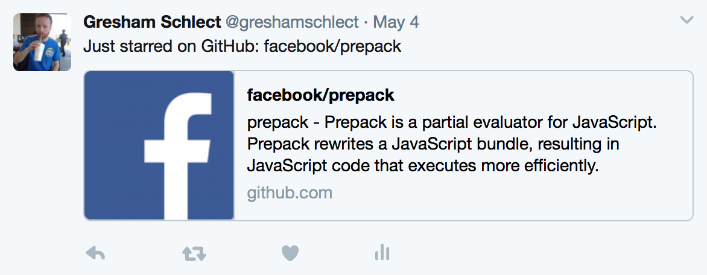

# Starbird

Using a scheduled AWS lambda function, starbird checks for newly starred repos on your GitHub account every minute and tweets any new ones on your twitter account. For example:

## Setup

1. Clone and `yarn install`
2. `cp config/default.json config/local.json`, fill in `config/local.json`
3. `yarn run deploy`

In order for starbird tweet on your behalf, you must [create a twitter app](https://apps.twitter.com/app/new) for the project. You will also need the [serverless](https://serverless.com) framework installed and configured with AWS credentials in order to deploy.
